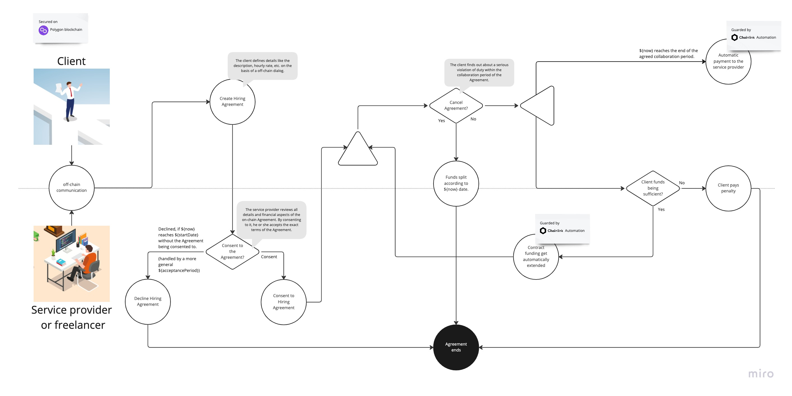

# contractful protocol

\[[Polygon Mumbai testnet | ✅ Deployed](https://mumbai.polygonscan.com/address/0xE4930EDeAd758036Bd830983A26340ac7F366869)\]

🙌️  News: **[For early MVP access, click here to participate in our survey from Nov to Dec 2022](https://forms.gle/E3xPJwu6wBbnvB7t6)**.

The protocol that realizes peer-2-peer, safe and secure Hiring Agreements for everyone to use.

You will also find [more details on the devpost page on the contractful project](https://devpost.com/software/contractful-hiring-agreements).

## Quick start

If you want to go ahead and put up a Hiring Agreement, please find [the demo link and quick start instructions for users in the contractful frontend project](https://github.com/contractful/frontend-v1).

## TL;DR

The contractful protocol lets everyone create peer-2-peer, safe and secure Hiring Agreements. Freelancers, service providers and also permanent employees can use contractful together with their clients or employers to manifest their collaboration terms on-chain.

The Agreement is build on top of an underlying agile collaboration process. It assumes contractor and contractee to exchange information on a regular basis ("Conversation over Documantation"). The budgets is escrowed by the Smart Contract along a sprint cycle (e.g. 2 weeks). In case of a successfull review, the budget is transferred to the contractee. In case of a dispute, the Agreement ensures a fair way of splitting the funds.

This enables DAOs, cryoto companies and startups to seemlessly hire staff for their projects on a global, borderless scale.

## User case of the contractful protocol

### For clients of the Hiring Agreement

👉 For freelancers and service providers in the crypto industry, the contractful Hiring Agreement lets you:

* Getting hired for an agile project by your client in a way that is fair, safe and transparent.
* In this process the underlying Smart Contract will escrow the budget for a 2 weeks sprint cycle. Payments are automated and dispensed on sprint review of each sprint and are guarded by the Polygon blockchain and Chainlink Automation.

### For freelancers or service providers working on the Hiring Agreement

👉 Benefits for clients:

* Automated payments: Easy and secure on-chain payment processing.
* Standardized and blockchain governed Hiring Agreements save hours of paper work.
* Access to a global hiring market.
* Full budget control: The Agreement ensures clean budget planning that matches your product development roadmap.

### Process of the Hiring Agreement

The following diagram describes the process of the protocol in-depth:

If you want to learn more about the inspiration, idea behind contractful, experiences with the implementation of the solution, and the future potential, [please visit the project's devpost page](https://devpost.com/software/contractful-hiring-agreements).

## The protocol architecture

* The protocol is provided on the **Polygon blockchain** as a Smart Contract.
* Automated migration of funds is realized through **Chainlink Automation**.
* Contract details are **stored on IPFS** and linked to the protocol via their `cid`.
* The protocol is accessible for users through the [contractful frontend application](https://github.com/contractful/frontend-v1) (official demo: <https://contractful.vercel.app/>).

### Why Polygon?

The Polygon blockchain ecosystem is very developer friendly. The chain itself is fast, permissionless and EVM compatible. Its Mumbai testnet can be accessed easily and provides all the necessary tooling (e.g. Faucet, Polygon).

### Why Chainlink Automation?

Once the budget for a payment period (e.g. a 2 weeks sprint) are delegated to the Hiring Agreement, and the freelancer or service prodiders starts working on the contract, it is critical to the solution that the payment is guaranteed to be released according to the pre-agreed terms. Chainlink Automation ensures that this will happen.

### Why IPFS?

contractful Hiring Agreements are decentralized in every aspect. But blockchains are not suitable to host big payloads of data (due to the high costs of blockspace). The detailed description of a Hiring Agreement can have an arbitrary size, and might also get comparably long. Therefore data of the description is stored on IPFS. To secure the description, it is encrypted using AES ([see the contractful frontend application](https://github.com/contractful/frontend-v1)).
